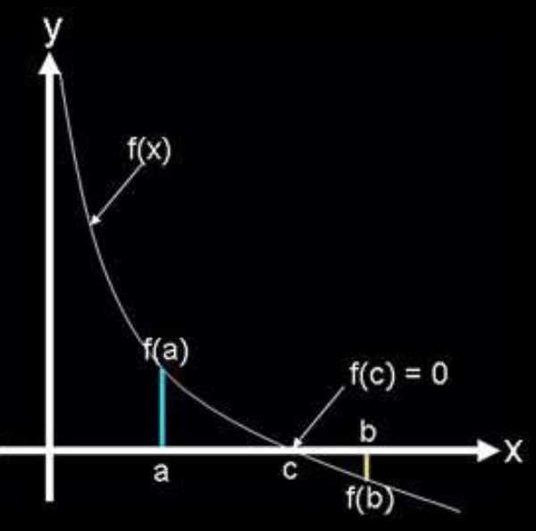

#Root Finding

## Bisection Method
The Intermediate Value Theorem says that if _f(x)_ is a continuous function between a and b, and
$sign(f(a)) \neq sign(f(b))$, then there must be _a_ _c_, such that $a < c < b$ and $f(c) = 0$. This is illustrated
in Fig. below

**Algorithm of Bisection Method used here**
1. Input two values of x that embrace the interval where the root is expected
2. Calculate corresponding values for y
3. Check for the sign difference between y-values.
4. If the signs are not opposite, stop
5. Calculate the value of x in the half of the interval
6. Check for the sign difference between the y-values first half interval 
7. If the signs are opposite, let x1 and x2 be the limits of the first half interval
8. Else let x1 and x2 be the limits of the second half interval
9. If values of y approaches zero, print the x-value and stop
10. Else repeat steps from 5 to 10.
